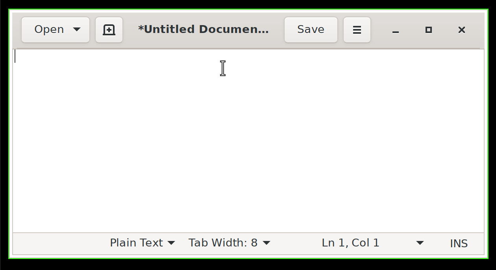

# `emoji-picker`
[](https://travis-ci.org/jmackie/emoji-picker)

<p align="center">
   
  
</p>

[`dmenu`](https://tools.suckless.org/dmenu/)-like Gtk thing for quickly looking up emojis. Why? Because I want quick emoji lookup everywhere. Why not use \<some existing terminal thing\>? Because my terminal font is bad.

## Installation

```
cargo install
```

Or if you're using [Nix](https://nixos.org/):

```
nix-env -f . -i
```

In which case you might also want use my [`cachix`](https://jmackie.cachix.org) 👍

```
cachix use jmackie
```

## Usage

```
emoji-picker
```

On it's own this will simply print your selection to `stdout`. So you'll probably want to pipe the output to your clipboard. Something like:

```
emoji-picker | xclip -selection clipboard
```

Then make that command a key binding and you're home and dry son 🔥

## Shoutouts

* The [`Gtk-rs`](https://gtk-rs.org/) people for doing a Good Job
* [`muan/emojilib`](https://github.com/muan/emojilib) for producing `emojis.json` 🙏
